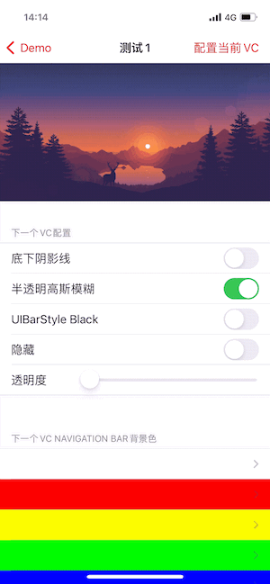

# XYNavigationKit

[](https://travis-ci.org/yuan188/XYNavigationKit)
[](https://cocoapods.org/pods/XYNavigationKit)
[](https://cocoapods.org/pods/XYNavigationKit)
[](https://cocoapods.org/pods/XYNavigationKit)




## 功能介绍

`XYNavigationBar` 继承 `UINavigationBar`，内部强制设置 `isTranslucent = true`
`XYNavigationController` 继承 `UINavigationController`， 内部使用了 XYNavigationBar

`UIViewController` `edgesForExtendedLayout` 默认包含 `.top`，
如需要修改为当不包含`.top`时，`xy_navigationBarAttributes`相关属性的透明质将会被忽略掉

⚠️**请勿再设置`UINavigationBar`相关属性值**

每个 UIViewController 都可以设置独立的属性，属性具体如下

```swift
// UIViewController 相关属性

/// UIViewController 各自对应NavigationBar的属性值
public var xy_navigationBarAttributes: XYNavigationBar.Attributes
    
/// 是否允许左滑返回
/// 默认值：true
public var xy_isSwipeBackEnabled: Bool

/// 是否允许全屏左滑返回
/// 默认值：false
public var xy_isFullScreenSwipeBackEnabled: Bool
    
// XYNavigationBar.Attributes 相关属性

/// bar 样式，默认为default
public var style: UIBarStyle
        
/// 是否有半透明虚化效果
/// backgroundColor, backgroundImage 无alpha通道时，透明度将默认为 0.85
/// 背景 alpha < 1 时，将没有虚化效果
/// 默认值：true
public var isTranslucent: Bool

/// bar 背景颜色，优先使用backgroundImage
/// 默认值：white
public var backgroundColor: UIColor?

/// bar 背景图
/// 默认值：nil
public var backgroundImage: UIImage? 

/// bar 背景透明度
/// 默认值：1.0，完全不透明
/// < 0.01时，触摸事件将穿透
public var backgroundAlpha: CGFloat

/// bar 是否隐藏背景
/// 默认值：false
/// true时，触摸事件将穿透
public var isBackgroundHidden: Bool

/// bar 底部阴影线是否隐藏
/// 默认值：false
public var isShadowHidden: Bool 

/// bar 底部阴影线 图片
/// 默认值：nil
public var shadowImage: UIImage? 

/// bar 底部阴影线颜色，优先使用 shadowImage
/// 默认值：nil
public var shadowColor: UIColor?

/// tintColor
public var tintColor: UIColor?
/// title 属性，默认适配 style
public var titleTextAttributes: [NSAttributedString.Key : Any]?
        
```

## Example

使用 `XYNavigationBar.attributes` 定义全局样式

```swift
func application(_ application: UIApplication, didFinishLaunchingWithOptions launchOptions: [UIApplicationLaunchOptionsKey: Any]?) -> Bool {
    // Override point for customization after application launch.
    
    XYNavigationBar.attributes.backgroundColor = .red

    return true
}
```

使用 `XYNavigationController` 代替 `UINavigationController`

```swift
self.window.rootViewController = XYNavigationController(rootViewController: UIViewController());
```

如果某个控制器的导航栏样式和全局样式有差异，可以使用 `UIViewController.xy_navigationBarAttributes` 中的属性，在 `viewDidLoad` 这个生命周期函数里进行微调

```swift
override func viewDidLoad() {
    super.viewDidLoad()

    xy_navigationBarAttributes.backgroundColor 
}

```

如果使用的是 storyboard，设置 `UINavigationController` 及 `UINavigationBar` 自定义类型

## Installation

XYNavigationBar is available through [CocoaPods](https://cocoapods.org). To install
it, simply add the following line to your Podfile:

```ruby
pod 'XYNavigationBar'
```

## Requirements

iOS 9+

## 感谢

在完善导航栏相关功能时，查看了 GitHub 上多个相关项目，其中给我帮助最大的是 [HBDNavigationBar](https://github.com/listenzz/HBDNavigationBar)，它为我解决不同背景之间如何平滑切换提供了非常有价值的参考。

## License

XYNavigationBar is available under the MIT license. See the LICENSE file for more info.
